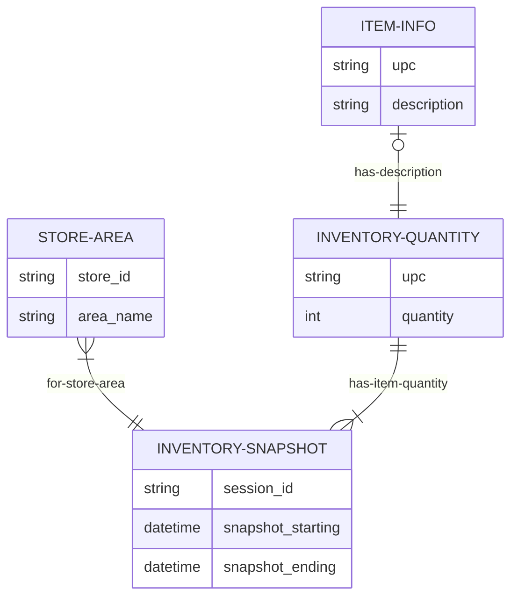
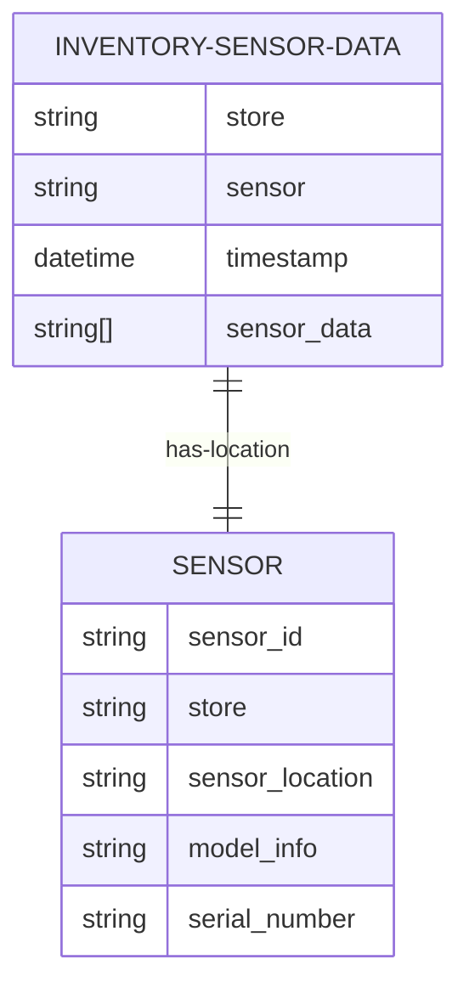

# Sensor Services

## Sensor Registry

#### Need to be able to connect with a sensor and register it to a store and location. Also need to be able to provide information to the sensor to upload data (e.g. storeId, credentials, a specific URL for a store, etc.)

 - Need a registry service to store this information

 - A mobile app that can connect via BLE or NFC?

 - Need additional service to remove a device from a location or relocate it

 - The information to connect must persist outside of powered ROM. For example, if a power outage occurs or a battery goes dead, then the device should reconnect when power is restored. Is there on-device storage accessible? 

 - Is it possible to reconnect via encrypted credentials in the firmware with BLE mesh?
-----

 ## Telemetry

 #### Need to be able to collect telemetry data from a sensor, especially when failures happen.

 - Is there anything being done in Captana or ELS that we can build upon?

 - A colored LED should be installed on the sensor to provide visual indication of state. (READING,CANNOT UPLOAD,LOW POWER,etc.)
 - The device should ping home with a heartbeat message (e.g. RAFT or GOSSIP protocol). This would include status updates in the ping (e.g. START SCAN CYCLE, END SCAN CYCLE, PING IDLE, UPLOAD FAILURE, etc.)

 - The biggest hurdle for at scale telemetry is if the sensor cannot connect via Wifi. How can this be circumvented? 

    - Is it possible to connect via BLE or NFC to retrieve the data locally?

    - Is it possible to use the store's BLE router?
    
    - Is there a way to use the rail wires and use the rail for communication? Is there any protocol or process available?

 - In the event any failure happens and the device is unable to send a telemetry event, the device should enter into a loop to resend the data/telemetry event. At a minimum, the last failure should be retainied until a connection can be restored should be retained on the device and send when a connection can be restored.

 - Logging should not impede functionality. In the rare need, sending telemetry should be something we can turn off on the device.

 - Stretch design: can we filter events? 

-----

## Inventory Snapshots

#### Problem: currently an inventory for a snapshot of time is bounded when the inventory has started and completed. With sensors installed everywhere in the store, how will we define this time boundary?

- Should we just schedule a job to run at incremental times and just compute the inventory count from readings since the last time one was taken?
- Should the backend send a message to the sensor to start capturing data? And then when data is collected from all sensors (or a reasonable time has expired) that the inventory has completed.
- Perhaps it might be easier to collect an inventory for smaller areas of a store, which should provide greater confidence in the accuracy of that inventory area. Then we can rollup all of these to a store level at query time.




-----

## Sensing at Scale

#### Currently the EPC data is processed immediately within the same request they all have been sent.

### Problems ###

1. If a failure happens while processing we lose all the data from that scan request.  
2. The current process only handles tags it is coded for. Any unknown tag types (e.g. SGLN location) are ignored and lost. There is no way to track that erroroneous EPC ids are being captured or the device itself in reading the data wrong. We also cannot replay any processing of the data captured. 
3. There are multiple flavors of SGTIN -- SGTIN64 (although not often used), SGTIN-96 (the most common), SGTIN-198. This past year new versions of SGTIN: SGTIN+ and DSGTIN+ were also added to the schema to allow metadata to be encoded with the SGTIN. DSGTIN+ is to allow an expiration date -- like with meat -- to be added to a the tag encoding.

### Efficient Idempotency
Sensor data should be saved to a database with only necessary validation and mininum processing necessary. The data can then be processed asynchronously without impeding the sensor. Processing the data can also be repeated as necessary if a recovery is necessary.




- There is not a singular standard format for a device MAC id -- which we use to uniquely identiy it. Because of this, the MAC id should be moved as part of the payload body and not a URL parameter. The proper cleaning of the MAC into a consistent format will be handled by the backend. 

    Store id is still captured as a URL parameter.

    Timestamp is an optional parameter.[^timestamp]
    
    ```json
    { 
        "sensor": "AB:CD:EF:01:23:45",
        "data": [

        ],
        "timestamp": "2024-08-22T01:01:01Z"
    }
    ```

    For EPC data an example would look like:

    ```json
    {
       "sensor": "AB:CD:EF:01:23:45",
       "data": [
          { "tag": "30ABCDEF0123456", "rssi": -120 },
          { "tag": "30ABCDEF0678912", "rssi": -80 },
          ...
       ] 
    }
    ```

[^timestamp]: Providing a timestamp is really not necessary because the backend will just apply the current datetime when the data is uploaded. If it is provided, prevision only to a second is required. The primary purpose of having it as an option makes it possible to upload data for different times as part of a recovery process.

- Asynchronous processing

  a. Use a topic (Kafka) for parallel processing.
  
  b. Async beans spawned from app server.


